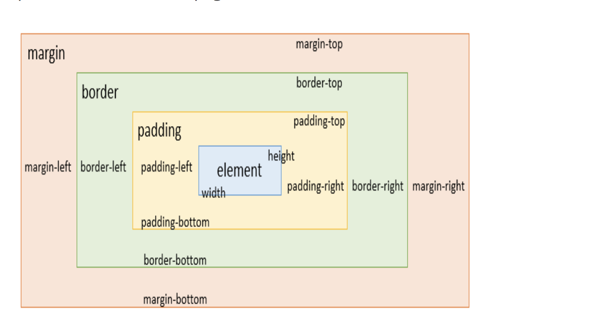

# 17.06.2019
## Setting up sass
- to run the server everytime change is made to both `package.json` & the `.scss` files `npm run sass | npm run dev` needs to run in the root terminal
- sass watch can be set to constantly note changes and reload the server automatically - this is done within the "scripts" section in the `package.json` file `"sass --watch pages/Landing/landing.scss:pages/Landing/landing.css"`. After the `sass --watch` `input path : output path` follows.
## CSS Notes
- the difference between using an  tag and using a background image
    - the HTML tag 
        - is to show the image
        - using img tag instead of background-image can dramatically improve performance of animations
    - CSS background-image
        - when the image is not part of the content
        - the browser needs longer to parse the CSS file, which eventually delays the loading of the entire page
- Unmatching path of an image could lead to `Refused to apply style from...is not a supported stylesheet MIME type, and strict MIME checking is enabled.` error
## Viewport Units
- em, rem, vh, vw
- vw - viewport width in percentage (1vw - 1% of viewport width)
- vh - viewport height in percentage (1vh - 1% of viewport height)
- pixels - used to be very commonly especially before responsive designs were introduced
    - disadvantage -  unit isn't scalable. Meaning pixel size is fixed and doesn't change according as viewport size varies
- so then em, rem, percent and viewport units were introduced
- [The entire blog for more details](https://medium.com/@madhum86/css-font-sizing-pixels-vs-em-vs-rem-vs-percent-vs-viewport-units-b1485716afe7)
# 18.06.2019
## More on Sass
- CSS sourcemaps and in-browser Sass editing 
    - CSS sourcemaps are the bridge between the browser and pre-processor such as Sass, so that the browser understands
        - Sass mixin
        - placeholder
        - variable
    - combining sourcemaps with console window of browsers(real-time mock reloading), speeds up editing workflow
    - CSS sourcemaps enable the browser to track Sass functionalities CSS generated by a 
    - [This link has some more details](https://medium.com/@toolmantim/getting-started-with-css-sourcemaps-and-in-browser-sass-editing-b4daab987fb0)
## CSS
- Contents under HTML elements are like layers of onions. Inside out they are denoted below sequencially
    - element - the text itself
    - padding - which sits between the padding and the margin
    - border - sits between padding and margin
    - margin - occupies the outermost above the border

**Figure 1** Image referring to the CSS box model
* Building layout
- Having an overview of the layout of a given a design could help roughly simplify before tackling the details. The list below should help categorize general overview
    - header tag
    - section tag
    - footer tag
    - navigation tag
# 19.06.2019
## Positioning in CSS
    - replacing `position: relative; or position: absolute` and manipulating with `margins & paddings` could be a better practice for positioning elements
    - flexbox is another handier method (one dimensional left to right or top to bottom)
        - `property selector id or class {justify-content: flex-start; or flex-end; or center; or space-between; space-around}` left to right 
        - `property selector id or class {align-items: flex-start; or flex-end; or center; or space-between; space-around}` top to bottom
    - css grid layout
## BEM101 (Block, Element, Modifier methodology)
- Why we should follow BEM
    - for easier readability and association of parent-child when producing a new style of a component
    - when only looking at html files, it's easy to lose track of which class names stands for which sections
    - the above mentioned associativities contribute to an easier time for code reuse and maintainability
# 20.06.2019
## Flexbox
- To use flexbox 
    - The container parent initially needs to be set to `display: flex`
    - (a parent could have a certain height and width specified)
    - `flex-wrap`
- More flexbox properties
    - align-contents
    - align-items
    - align-self
- Em vs Rem
    - Em cascades as it primarily relies on the parent block
    - Rem is a better practice, as it's dependent on the given defined pixel size in the root
    - the font size should be defined at root of the html `:root {font size: 16px}` or else the default font-size value browsers take is assumed, which is normally 16px

# 21.06.2019 
## More on Flexbox 
-  inside of a block of 
    ```
    #example {
    display: flex; 
    justify-content: flex-start; //aligns items to the left most of the container block
    justify-content: center; // centers items relative to the container block
    justify-content: flex-end; // aligns items to the right most of the container block
    justify-content: space-around; // evenly spreads the items, with equal spacing 
    justify-content: space-between; // splits items so they are equally spaced in the middle
    (justify-content: aligns items along the main axis)
    flex-direction: row; // from left to right 
    flex-direction: row-reverse; // from left to right in reverse order
    flex-direction: column; // from top to bottom 
    flex-direction: column-reverse; // from top to bottom in reverse order 
    flex-flow: row wrap or column wrap; // shorthand property for `flex-direction` and `flex-wrap`allows for flexibility of items on the main or cross axis, to follow multiple lines  (also works of row-reverse and column reverse)
    flex-grow: 1; controls how much space how much of space should be assigned. The rest of the space comprises the difference between the container and of the flex items altogether.
    flex-shrink: 0; // means, no shrink is applied.
    flex-shrink: 1 or 2 or 3;  // space becomes shrunk depending on the factor following the number of items.
    flow-wrap: wrap; // allows for flex items to flow onto multiple lines (nowrap is the default)
    align-items: flex-end; or flex-start; or center; or baseline; or stretch; //aligns vertically aligns items along the cross axis accordingly (a combination of justify-content and align-items could also be used)
    place-items: a shorthand for `align-items` and `justify-items` properties respectively. When the latter isn't used, it takes the first one for both.
    order: ;// sets the order so that items are sorted in ascending order (also negative values are allowed)
    }
    ```
    - Here is [a reference link](https://css-tricks.com/snippets/css/a-guide-to-flexbox/) that guides through  and distinguishes between the properties used for the flex container(parent element) and the flex items (child elements)
    