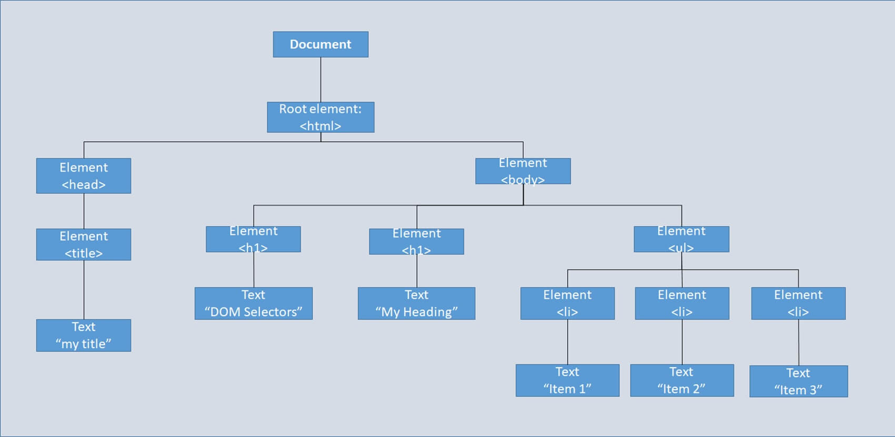
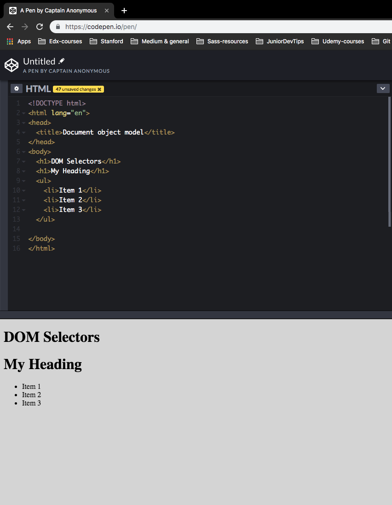

# 08.07.2019
## Commiting best practices
    - commit early commit often
    - commit changes separately, individual commit messages targetting each change
    - this should make the track easier to follow
## Why CSS styling with IDs needs to be avoided and classes should be used for that
1. Class specificity is lower than ID specificity - placing "!Important" is the only one with higher priority to ID. As keeping files maintainable is crucial in development, overriding should be easy enough, hence preference of classes.
2. A class name can be reused while IDs can only be used max once in an HTML file
3. More conventions that IDs are attached to the class attributes, so it’s ideal to keep this consistency to help other easily understand
4. An element can have several classes
    1. Many classes could be added to an HTML element
    In this class naming convention, `<div class="text-bold banner-text js-banner-text"></div>`, classes for styling and a class for a javascript hook are grouped together.
    Although IDs could as well 
[The original link for the blog] (https://dev.to/claireparkerjones/reasons-not-to-use-ids-in-css-4ni4)

# 09.07.2019
## Ways to build accordions(aka collapsibles)
- To avoid browser inconsistencies / provide with cross-browser consistency there are two common approaches implemented
        - Reset CSS
            - is a way to define the style to tailored to user's needs
            - discards the browsers' default styling
        - Normalize.css (unlike Reset CSS, doesn't unstyle the browser's default styling)
            - preserves some useful defaults
            - after comparing the W3C standards of the styles - normalize.css will fix the browser style which is inconsistent
            - applies basic styles before you've even written a single style
            - fixes some common bugs
            - default for h1 to h6 HTML tags
                - bigger font-size
                - margin on the top & bottom
- An example of <h1> default styles in chrome

```css
h1 {
    display: block;
    font-size: 2em;
    margin-block-start: 0.67em;
    margin-block-end: 0.67em;
    margin-inline-start: 0px;
    margin-inline-end: 0px;
    font-weight: bold;
}
```

- [Blog post - Normalize CSS or CSS Reset](https://medium.com/@elad/normalize-css-or-css-reset-9d75175c5d1e)
- one real-life example 
- *Chrome, Safari and Firefox* render `<h1>` tags that are inside an `<article>`/ `<aside>`/ `<nav>`/ `<section>` tag with a font-size that is smaller than an independent `<h1>` tag, and with a different margin size.

The Internet Explorer and EDGE browsers apply different style. Although it would make sense that the styles in `normalize.css`. But it isn't possible to target IE / EDGE.

For `<h1>` styles to act the same for all browsers, `normalize.css` defines the  IE/EDGE styles to be applied by all browsers.

```css
/* 
  Correct the font size and margin on `h1` elements within `section`  and `article` contexts in Chrome, Firefox, and Safari.
*/
 h1 {  font-size: 2em;  margin: 0.67em 0;} 
 ```

 ```html
 <div class="wrap-collapsible">
    <input id="collapsible" class="toggle" type="checkbox">
    <label for="collapsible" class="lbl-toggle">More Info</label>
   <div class="collapsible-content">
    <div class="content-inner">
      <p>
        QUnit is by calling one of the object that are embedded in JavaScript, and faster JavaScript program could also used with
        its elegant, well documented, and functional programming using JS, HTML pages Modernizr is a popular browsers without
        plug-ins. Test-Driven Development.
      </p>
    </div>
  </div>
</div>
```
Ways with the
`<summary>` and `<details>` HTML tags
[Accordion with HTML Elements `<details>` and `<summary>`] (https://www.imarketinx.de/artikel/html-accordion-details-and-summary.html)

# 10.07.2019
## Javascript in the browser
### Methods
  - the `this` keyboard (often refers to the immediately above placed function or variable.method)
  - `querySelector` (method that gets the first Element in the document matching the selector)
  - `querySelectAll` (method that gets all of the elements in the document matching the selector)
  - `getElementById` (method that gets all of the elements in the document with the specified ID - Element signals singular )
  - `getElementsByClassName` (because elements is plural, it must have contained a list of items, where indices come in to play, represented by [i] referring to the position of target element, i.e first, second etc.)
  - `getElementByTagName` (method that gets all of the elements in the document with the specified tag name)
  - `.firstElementChild.innerHTML`
  - The firstElementChild property returns the first child element of the specified element.
  - 
  - `maxHeight` property - document.getElementById("myDIV").style.maxHeight = "15px"; // set the max height of a <div> element
  - `maxHeight` has effect only on block-level elements or on elements with absolute or fixed position
  - `classList.toggle`
  - `nextElementSibling` (targets the next sibling element within the target parent)
  - `previousElementSibling` (targets the previous sibling element within the target parent)


>The difference between this property and `firstChild`, is that `firstChild` returns the first child node as an element node, a text node or a comment node (depending on which one comes first), while `firstElementChild` returns the first child node as an element node (ignores text and comment nodes).

>Tip: Use the children property to return any child element of a specified element. children[0] will produce the same result as firstElementChild.

>Tip: To return the last child element of a specified element, use the lastElementChild property.

# 11.07.2019
## Designed version vs implemented version
  - Put the implemented version of next to the suggested design by the designer
### DOM manipulation
  - a way to access and manipulate the HTML structure using JS
  - [Here is everything about DOM manipulation](https://www.freecodecamp.org/news/dom-manipulation-in-vanilla-js-2036a568dcd9/)
  - accessing / looking up the elements
    - finding single element
      - `document.getElementById('idname')`
      - `document.querySelector`
    - finding multiple of them
      - `.document.getElementsByClassName`
      - `.document.querySelectorAll`
  - traversing the DOM
    - `.firstChild`
    - `.lastChild`
    - `.nextElementSibling`
    - `.previousElementSibling`
      - Demo

```html
<html lang="en">
<head>
  <meta charset="UTF-8">
  <meta name="viewport" content="width=device-width, initial-scale=1.0">
  <meta http-equiv="X-UA-Compatible" content="ie=edge">
  <title>Document</title>
</head>
<body>
  <h2 id="title">Node.nextElementSibling - JS DOM - test</h2>
  <ul id="myList">
    <li>Firstlist</li>
    <li>Secondlist</li>
    <li>Thirdlist</li>
  </ul>  
</body>
</html>
```

```javascript
// selects any <li> that is the first element of its type among its siblings
const firstItem = document.querySelector('#myList > li:first-of-type');
console.log(firstItem); // returns <li>Firstlist</li>
const secondItem = firstItem.nextElementSibling;
console.log(secondItem); // returns <li>Secondlist</li>
```


- This DOM image above corresponds to the screenshot of the HTML file below.


  - Targetting and updating elements
    - Getting or setting text content
    - nodeValue or textContent
      - nodeValue
        - set or get the *text content* of a text node
      - textContent
        - used to set or get the text of a *containing element*
        
# 12.07.2019
## Reusing classes
### Different elements sharing the same classes
  - saving the same class to apply to different elements / sections could help refactor or be less redundant with codes in CSS
 [Link to show a demonstration](https://codepen.io/anon/pen/wLLvmg)