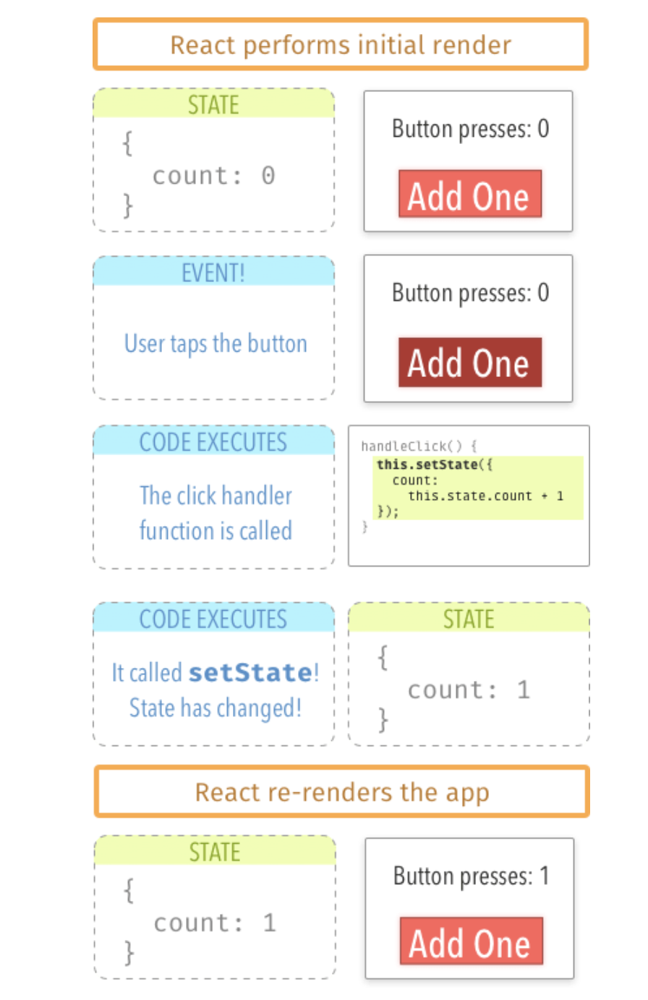

#02.09.2019
## Debug techniques 
// Ways to go about....
- go to the indicated line inside the file`console.log` right before ahead of the error to see what that returns
- 
// when getting stuck on a bug
 ### the concept of states in React 
 - [A visual guide to understanding State in React](https://daveceddia.com/visual-guide-to-state-in-react/)
 - 
# 03.09.2019

#	// const listMovieRender = React.createClass;Elaborate on these ones below
	```javascript
    const truthyEx = true && 'Hello World';

	console.log(truthyEx); // truthy

	const falsyEx = false && 'HelloWorld';

	console.log(falsyEx); // falsy

	// if (!showCharacters) {
	// 	return showMovies;
	// }

	// if (!showMovies) {
	// 	return showCharacters;
	// }

    	// const listMovieRender = React.createClass;
	const truthyEx = true && 'Hello World';

	console.log(truthyEx); // truthy

	const falsyEx = false && 'HelloWorld';

	console.log(falsyEx); // falsy

	// if (!showCharacters) {
	// 	return showMovies;
	// }

	// if (!showMovies) {
	// 	return showCharacters;
	// }
```
 ### conditional statements in ReactJS
 - these could either be defined as a funtion, but certainly not within the render block
 - 